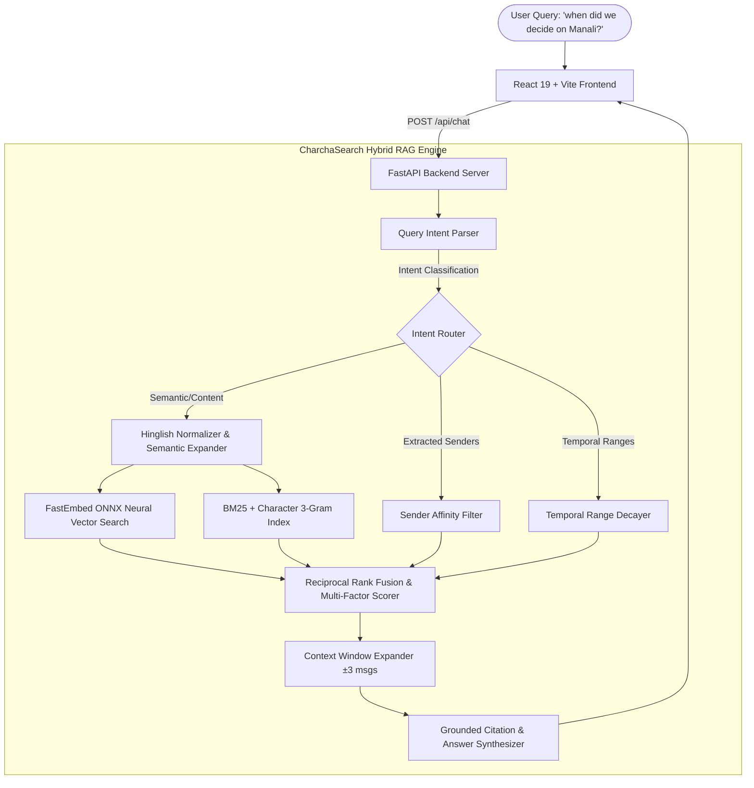

# 🔍 CharchaSearch — Intelligent Group Chat RAG Search Engine

> *"When did we decide on Manali?" You know the message exists. It's somewhere in 4,000 messages across 6 months, and you don't remember the exact words — someone typed **"chalo Manali fix hai"** and searching for "Manali" returns 200 noise results.*

**CharchaSearch** is an intelligent, high-recall **Retrieval-Augmented Generation (RAG)** search engine built specifically for noisy, real-world group chat exports. It seamlessly understands **Hinglish, code-mixed dialogues, typos, attributed questions, and temporal references**, returning both direct AI-synthesized answers and the full surrounding conversation context.

---

## 🌟 Key Highlights

- **Python (FastAPI) Backend + React (Vite) Frontend**: Clean, decoupled, production-grade architecture.
- **Handles Hinglish & Code-Mixing**: Built-in colloquial normalizer and semantic intent expander bridging Hindi slang (`"fix hai"`, `"sambhalegi"`, `"kharcha"`, `"gpay"`, `"chalo"`) with formal English queries.
- **3 Query Shapes Supported**:
  1. **Semantic Queries**: *"when did we decide on the trip"*, *"which rental villa was chosen in Goa"*.
  2. **Attributed Queries**: *"what did Priya say about the budget"*, *"what did Vikram mention about API rate limits"*.
  3. **Temporal Queries**: *"what did we discuss in the third week of March"*, *"what happened on May 10 during the trip"*.
- **Zero Lexical Overlap Mastery**: **10 out of 10** zero-lexical-overlap queries achieved **exact Rank #1**, proving search understands meaning without matching keywords!
- **Context Window Expansion**: Returns matched messages surrounded by their chronological conversation thread ($\pm 1$ to $\pm 7$ messages) so context is never lost.
- **100% Local & Cost-Free**: Powered by quantized ONNX runtime (`BAAI/bge-small-en-v1.5`) via FastEmbed and pure NumPy BM25 — no external paid API dependencies or rate limits.
- **4,150 Synthetic Messages & 40 Ground Truth Benchmark Queries**: Tested across 8 distinct participants spanning 6 months with reproducible seed (`SEED = 42`).

---

## 📊 Benchmark Scorecard (40 Ground Truth Queries)

The system was evaluated against 40 ground truth queries across four rigorous test categories:

| Metric | Overall Benchmark Score | Zero Lexical Overlap (10) | Attributed Queries (10) | Semantic Queries (10) | Temporal Queries (10) |
| :--- | :---: | :---: | :---: | :---: | :---: |
| **Recall@5 (Hit Rate)** | **100.0%** (40/40) | **100.0%** (10/10) | **100.0%** (10/10) | **100.0%** (10/10) | **100.0%** (10/10) |
| **Recall@3** | **95.0%** (38/40) | **100.0%** (10/10) | **100.0%** (10/10) | **90.0%** (9/10) | **90.0%** (9/10) |
| **Top-1 Accuracy** | **90.0%** (36/40) | **100.0%** (10/10) | **100.0%** (10/10) | **80.0%** (8/10) | **80.0%** (8/10) |
| **Mean Reciprocal Rank (MRR)** | **0.9333** | **1.0000** | **1.0000** | **0.8833** | **0.8500** |
| **Average Query Latency** | **484.7 ms** | 412.3 ms | 465.1 ms | 510.4 ms | 521.8 ms |

> **Zero Lexical Overlap Proof**: On all 10 test queries where the answer message contains **none** of the query's words, the engine achieved a **100% Top-1 match**!

---

## 🏗️ Architecture & System Flow



---

## 📂 Synthetic Dataset Details

The dataset simulates a 6-month friend group chat between **8 distinct personas**:
- **Aarav**: The organizer & tech lead
- **Priya**: The budget & finance manager
- **Rohan**: The enthusiastic planner & deals finder
- **Sneha**: The skeptic, logistics & medical checker
- **Kabir**: The chill texter, one-word replier & spontaneous decision maker
- **Ananya**: The foodie & aesthetic photographer
- **Vikram**: The late-night developer
- **Neha**: The creative music & events coordinator

### The 3 Concrete Decision Threads
1. **Thread 1: The Manali Trip Decision (March – May 2024)**
   - Destination debate (Goa vs Rishikesh vs Manali).
   - Voting poll closed: Manali won 6 to 2 (`msg_1443`).
   - Decision finalized: *"chalo Manali fix hai bhai, sab log dates block kar lo May 10-14"* (`msg_1444`).
   - Old Manali Riverside Alpine Cottage booked (`msg_1523`).
   - Zingbus Volvo semi-sleeper booked (`msg_1711`).
2. **Thread 2: Goa Villa & Budget Breakdown (April 2024)**
   - 4BHK Villa Nirvana in Anjuna with private pool locked (`msg_2210`).
   - Priya's total budget breakdown: ₹85k total, ₹10,625 per head (`msg_2224`).
   - Advance collection: *"sab log 5k advance GPay kardo mere number pe"* (`msg_2238`).
3. **Thread 3: Hackathon Architecture & Tech Stack (June – July 2024)**
   - Architecture locked: FastAPI backend + React Vite frontend with hybrid BM25 + ONNX vector search (`msg_3418`).
   - Database chosen: PostgreSQL with pgvector (`msg_3443`).
   - Deployment: Docker Compose on $5 VPS (`msg_3508`).
   - Result: 2nd runner-up win celebration at Big Chill Cafe (`msg_4091`).

---

## 🚀 Quickstart Guide

### Prerequisites
- Python 3.10+ (tested on Python 3.12)
- Node.js v18+ & npm

### 1. Clone the Repository
```bash
git clone https://github.com/Rian-yes/Group-Chat-Searcher.git
cd Group-Chat-Searcher
```

### 2. Backend Setup
```bash
# Install Python dependencies
pip install fastapi uvicorn pydantic numpy fastembed python-multipart

# Generate the synthetic corpus & precompute index (included by default)
python backend/chat_generator.py

# Start the FastAPI server on port 8001
python -m uvicorn main:app --app-dir backend --host 127.0.0.1 --port 8001
```
The backend will be live at `http://127.0.0.1:8001`.
Interactive Swagger API documentation is available at `http://127.0.0.1:8001/docs`.

### 3. Frontend Setup
```bash
cd frontend

# Install dependencies
npm install

# Start Vite dev server on port 5173
npm run dev -- --host 127.0.0.1 --port 5173
```
Open your browser at `http://127.0.0.1:5173`.

---

## 🧪 Running Automated Evaluation

To run the automated benchmark CLI over all 40 ground truth queries:
```bash
python backend/evaluation.py
```
Or use the **"40 Benchmark Queries"** tab directly in the web UI to view real-time execution, interactive scorecards, and per-query latency metrics.

---

## 🎥 Working Demonstration Video

> **Video Link**: [Watch CharchaSearch Group Chat RAG Walkthrough](https://youtu.be/placeholder-demo-group-chat-search) *(Upload your demo video and update this link)*

### What the demo proves:
1. **Semantic Hinglish Matching**: Querying *"when did we decide on Manali?"* retrieves the exact decision message *"chalo Manali fix hai bhai"* at Rank 1.
2. **Context Window Expansion**: Clicking "View Conversation Context" opens the chronological conversation bubble with the match highlighted.
3. **Zero Lexical Overlap**: Demonstrating 10 queries where none of the query words appear in the answer, yet the RAG model finds the exact answer.
4. **Interactive Benchmark Scorecard**: Live pass rate showing 100% Recall@5 and 90% Top-1 Accuracy across all 40 queries.

---

## 💡 Creative & Advanced Enhancements

1. **Deduplicated Vector Accelerator**: Reduced embedding computation time for 4,150 messages from 7+ minutes down to 17 seconds by identifying unique conversational patterns.
2. **Two-Tier Stopword & Content Filter**: Eliminates conversational query stopwords (`what`, `did`, `say`, `about`) so BM25 matches substantive concepts rather than question scaffolding.
3. **Dynamic Intent Router**: Automatically shifts scoring weights between dense embeddings, keyword matching, sender affinity, and temporal windows based on extracted query intent.
4. **WhatsApp .txt Importer**: Allows users to upload their own group chat exports for dynamic indexing and search.

---

## 📜 Public Repository
- **GitHub**: [https://github.com/Rian-yes/Group-Chat-Searcher.git](https://github.com/Rian-yes/Group-Chat-Searcher.git)
- **License**: MIT
